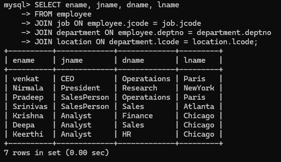
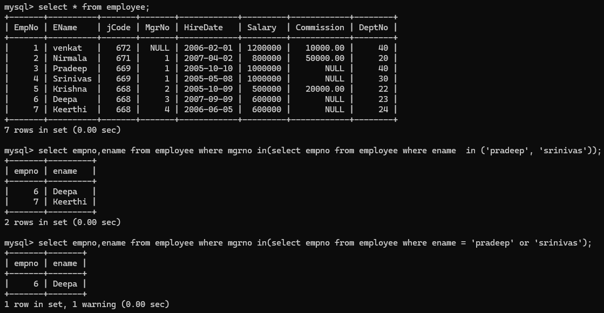
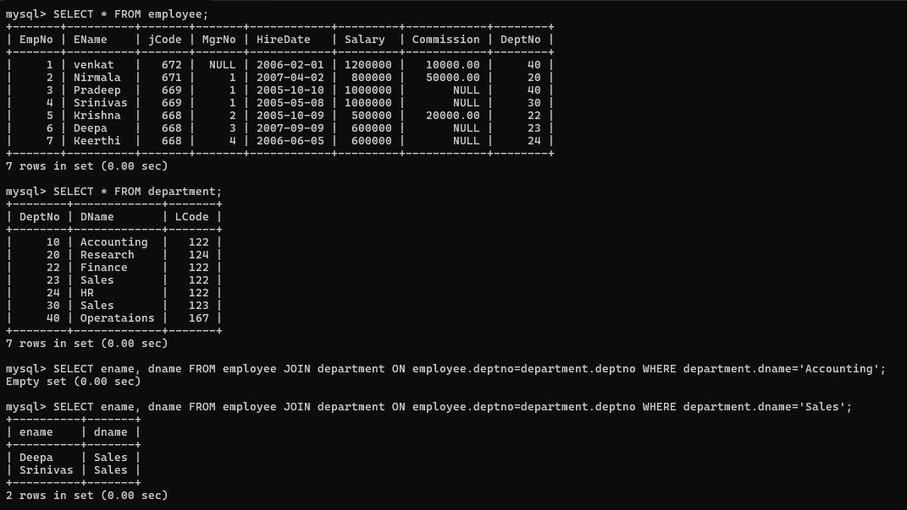

# Query Format:


### 1)  Create Database , tables and insert values in tables ?

#### Query

```sql
CREATE DATABASE database1;   #Database created
```
* To use Database:

```sql
USE database1;
```
* Use created database and create tables inside database. Later insert data in all tables.

    * Create job table and insert values:

       

        ```sql
        CREATE TABLE Job( 
        JCode INT(3) PRIMARY KEY, 
        JName VARCHAR(35) NOT NULL); 
        
        ## Table Name:JOB

        Insert into job values(666,'Clerk'); 
        Insert into job values(667,'Trainee'); 
        Insert into job values(668,'Analyst'); 
        Insert into job values(669,'SalesPerson'); 
        Insert into job values(670,'Manager'); 
        Insert into job values(671,'President'); 

        ```
   * Create Department table and insert values:

       

        ```sql
        CREATE TABLE Department( 
        DeptNo INT(3) PRIMARY KEY, 
        DName VARCHAR(35), 
        LCode INT(3) REFERENCES Location(lCode)); 
        
        ## Table Name:Department 

        Insert into department values(10,'Accounting',122); 
        Insert into department values(20,'Research',124); 
        Insert into department values(30,'Sales',123); 
        Insert into department values(40,'Operataions',167); 
        Insert into department values(22,'Finance',122); 
        Insert into department values(23,'Sales',122); 
        Insert into department values(24,'HR',122); 
        ```
    * Create Employee table and insert values:
        
        


        ```sql
        CREATE TABLE Employee( 
        EmpNo INT(3) PRIMARY KEY, 
        EName VARCHAR(35) NOT NULL, 
        jCode INT(3) REFERENCES job(jCode), 
        MgrNo INT(3) REFERENCES Employee(EmpNo), 
        HireDate DATE, 
        Salary INT(10), 
        Commission FLOAT(11,2), 
        DeptNo INT(3) REFERENCES Department(DeptNo)); 
        
        # Table Name:Employee 

        Insert into employee values(1,'venkat',672,NULL,'2006-02-01',1200000,10000,40); 
        Insert into employee values(2,'Nirmala',671,1,'2007-04-02',800000,50000,20); 
        Insert into employee values(3,'Pradeep',669,1,'2005-10-10',1000000,NULL,40); 
        Insert into employee values(4,'Srinivas',669,1,'2005-05-08',1000000,NULL,30); 
        Insert into employee values(5,'Krishna',668,2,'2005-10-09',500000,20000,22); 
        Insert into employee values(6,'Deepa',668,3,'2007-09-09',600000,NULL,23); 
        Insert into employee values(7,'Keerthi',668,4,'2006-06-05',600000,NULL,24); 
        

        ```

### 2) find the employee who hired before 2007?

#### Query :
```sql
SELECT * FROM employee WHERE YEAR(Hiredate) < 2007;
```


### 3) find the employee whose job code is 679?

#### Query :

```sql
SELECT * FROM job WHERE jcode = 679;
```


### 4) Find the details of employee whose commission is more than salary ?

#### Query:

```sql
SELECT * FROM employee WHERE commission > salary;
```


### 4) Find the details of employee whose total earnings( commission + salary) is more than 6L ?

#### Query:

```sql
SELECT * FROM employee WHERE (commission + salary) > 600000;

or 

SELECT * FROM employee WHERE commission AND salary > 800000;
```


# 11/09/2024

### 1) Display the Employee name and Job name of all the employees ?

#### Query:

```sql
SELECT ename,jname FROM employee, job WHERE employee.jcode = job.jcode;
```


### 2) Display department name and its location name for all department ?

#### Query:
```sql
SELECT dname, lname FROM department, location WHERE department.lcode = location.lcode; 
```


### 3) Display the Employee name and Job name of all the employees in department number 30 ?

#### Query:
```sql
SELECT ename,jname FROM employee, job WHERE employee.jcode = job.jcode AND deptno = 30;
```


### 4) Display the Employee name, Job name and Department number  of all the employees?

#### Query:
```sql
SELECT ename,jname,deptno FROM employee, job WHERE  employee.jcode = job.jcode;
```


### 5) Display Employee name and Department name for all analysis ?

#### Query:
```sql
SELECT ename,dname FROM employee, department WHERE employee.deptno = department.deptno;
```


# 12-09-2024

### 1) Write a query to display all the department names and their location names ?

#### Query:
``` sql
SELECT dname, lname FROM department JOIN location ON department.lcode = location.lcode;

or

SELECT dname, lname FROM department, location WHERE department.lcode=location.lcode;
```


### 2) Write a query to display the name, job name, department name and location of every employee ?

#### Query:
```sql
SELECT ename, jname, dname, lname FROM employee, job, department, location WHERE employee.jcode=job.jcode AND employee.deptno=department.deptno AND department.lcode=location.lcode;

or

SELECT ename, jname, dname, lname
FROM employee
JOIN job ON employee.jcode = job.jcode
JOIN department ON employee.deptno = department.deptno
JOIN location ON department.lcode = location.lcode;
```


### 3) Write a query to display the list of departments with at leat one analyst along with their location name ?

#### Query:
```sql
 SELECT ename, dname, jname FROM employee JOIN job ON employee.jcode=job.jcode JOIN department ON employee.deptno=department.deptno WHERE job.jname='Analyst';
```


### 4) Display list of emp working under either pradeep or srinivas ?

#### Query:
```sql
SELECT empno,ename FROM employee WHERE mgrno IN(SELECT empno FROM employee WHERE ename  IN ('pradeep', 'srinivas'));

or

SELECT empno,ename FROM employee WHERE mgrno IN(SELECT empno FROM employee WHERE ename = 'pradeep' or 'srinivas');
```


### 5) Display list of employess who are in accounts department ?

#### Query:
```sql
SELECT ename, dname FROM employee JOIN department ON employee.deptno=department.deptno WHERE department.dname='Accounting'
```


### 6) write a query to display the names and salaries of employees in research department ?

#### Query:
```sql
SELECT employee.ename, employee.deptno, employee.salary, department.dname FROM employee, department WHERE employee.deptno = department.deptno AND dname = 'Research';

or

SELECT ename, salary, dname FROM employee JOIN department ON employee.deptno=department.deptno WHERE department.dname='Research';
```


### 7) find the employees who are getting max salary in their respective job ?

#### Query:
```sql
SELECT ename,salary,jname FROM employee JOIN job ON employee.jcode=job.jcode WHERE employee.salary=(SELECT MAX(salary) FROM employee WHERE employee.jcode=job.jcode);
```


### 8) Display name of employee whose salary is highest without using MAX() function ?

#### Query:
```sql
SELECT ename,salary FROM employee WHERE salary=(SELECT MAX(salary) FROM employee );

or 

SELECT ename FROM employee JOIN job ON employee.jcode=job.jcode WHERE employee.salary=(SELECT MAX(salary) FROM employee);  
```


### 9) Write a query to display highest salary department wise and name of employees who is getting salary ?

#### Query:
```sql
# To know all departments employees salaries

SELECT ename,dname,salary FROM employee JOIN department ON employee.deptno=department.deptno; 

# To know department wise highest salary to employees 

SELECT ename,dname,salary FROM employee JOIN department ON employee.deptno=department.deptno WHERE employee.salary=(SELECT MAX(salary) FROM employee WHERE employee.deptno=department.deptno);

```


