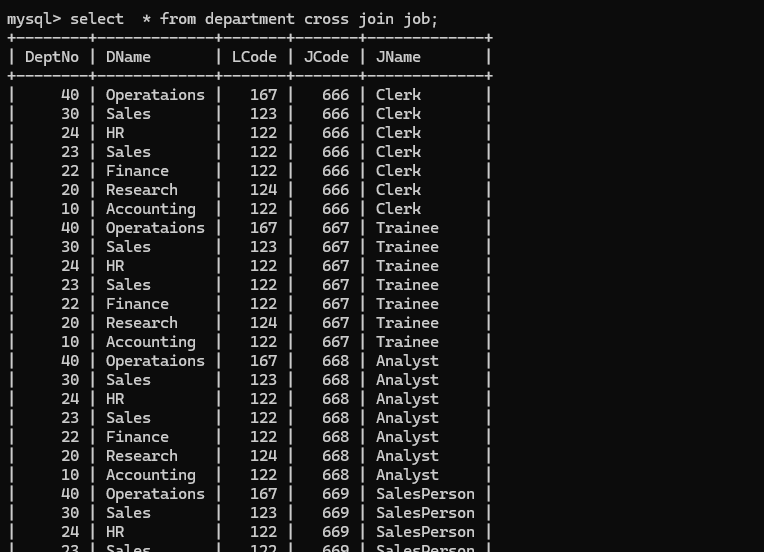
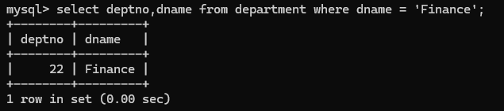
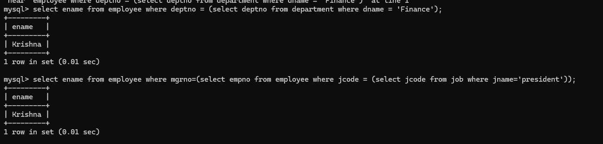
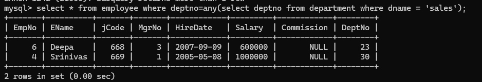
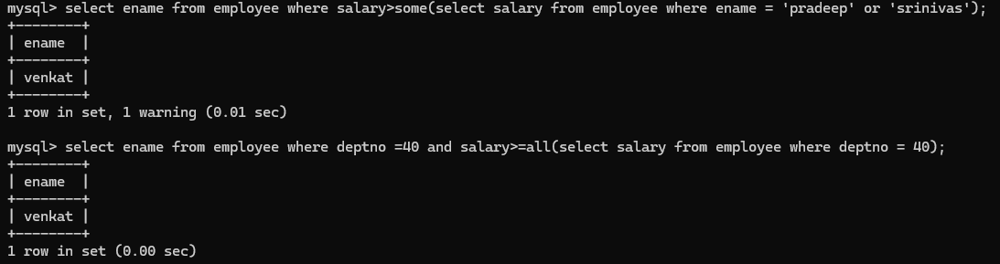
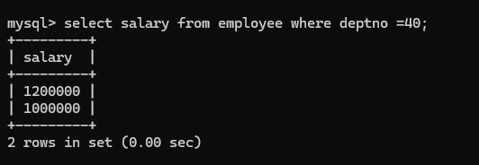
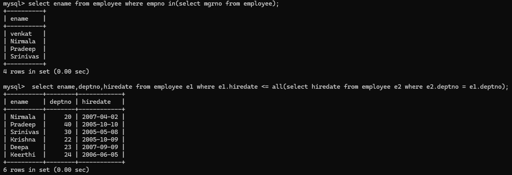
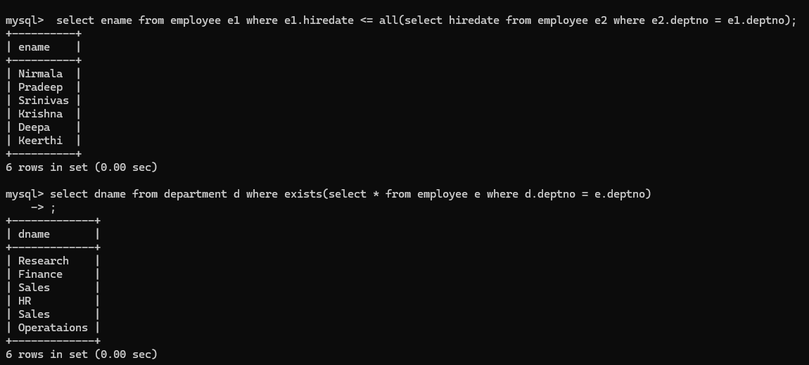

### cross join

```sql
select  * from department cross join employee;

select  * from department cross join job;
```


### To know prticular deptno of that department

```sql
select deptno,dname from department where dname = 'Finance';
```


###  To know particular department employee name

```sql
select ename from employee where deptno = (select deptno from department where dname = 'Finance');

select ename from employee where mgrno=(select empno from employee where jcode = (select jcode from job where jname='president'));
```


### To know sales department employee details

```sql
select * from employee where deptno=any(select deptno from department where dname = 'sales');
```


### To know which employee is high salary for pradeep or srinivas 

```sql
select ename from employee where salary>some(select salary from employee where ename = 'pradeep' or 'srinivas');

select ename from employee where deptno =40 and salary>=all(select salary from employee where deptno = 40);
```



### To know salaries of employees from depatno = 40 ?

```sql
select salary from employee where deptno =40;
```



```sql
select ename from employee where empno in(select mgrno from employee);
```

```sql
select ename,deptno,hiredate from employee e1 where e1.hiredate <= all(select hiredate from employee e2 where e2.deptno = e1.deptno);

select ename from employee e1 where e1.hiredate <= all(select hiredate from employee e2 where e2.deptno = e1.deptno);

select dname from department d where exists(select * from employee e where d.deptno = e.deptno);
```







### Group by

```sql
select jcode,count(jcode) FROM employee GROUP BY jcode;
```

